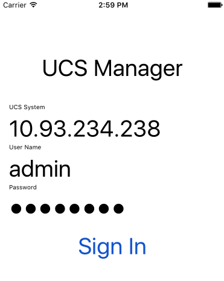

# UCSM in Swift

This repository shows an example implementation for communicating with UCS using an iOS device.  This is a work in progress and nowhere near anyplace that could be considered usable let alone functionable.  

The solution uses and requires the following components: 

* Swift 3.0
* Alamofire 4.0.1
* XCode 8.0

The idea is that it's not fully functional, but provides a good starting point for building a more complicated application that can communicate with UCS Manager and do all the cool things you've been wanting to do with a mobile device.  

## Building

When you download the project, you'll need to build the pods.  I've included a Podfile for you so all you should have to do is run: 

```
pod install
```
and it will grab all the dependencies and go along it's merry way. 

Next open up the project in Xcode by running: 

```
open UCS.xcworkspace
```
You should be able to run the project and see the login screen and sign in: 



Clicking the sign in button will then login.  You should see the token in the output log that can then be used for subsequent calls.  
